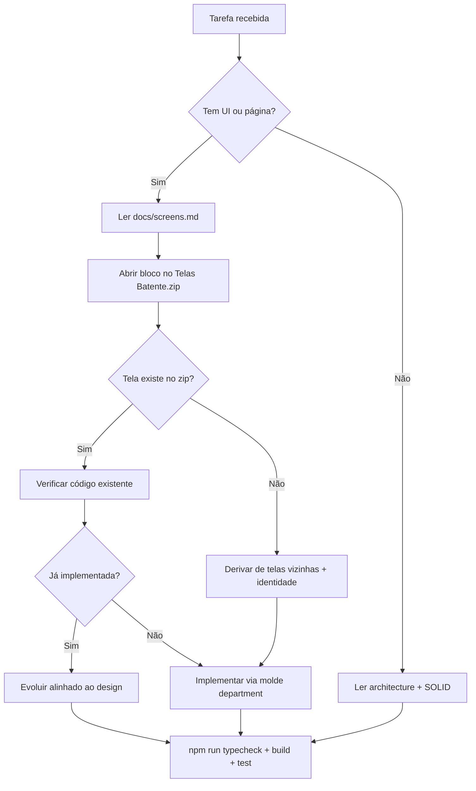

# Guia de agentes — BATENTE Frontend

Documento central para agentes de IA (Claude Code, Cursor, Codex e similares) que trabalham neste repositório.

## Mapa de ferramentas

| Ferramenta | Ponto de entrada | Detalhe |
|---|---|---|
| **Claude Code** | [`CLAUDE.md`](../CLAUDE.md) | Carregado automaticamente na raiz |
| **Claude Code** | [`.claude/project.md`](../.claude/project.md) | Complemento do projeto |
| **Cursor** | [`AGENTS.md`](../AGENTS.md) | Regras gerais do agente |
| **Cursor** | [`.cursor/rules/`](../.cursor/rules/) | Regras por contexto (`.mdc`) |
| **Codex / outros** | [`AGENTS.md`](../AGENTS.md) | Mesmo conteúdo base |

### Regras Cursor (`.cursor/rules/`)

| Arquivo | Escopo | `alwaysApply` |
|---|---|---|
| [`architecture-core.mdc`](../.cursor/rules/architecture-core.mdc) | Camadas, fluxo de dados, regras invioláveis | sim |
| [`solid-principles.mdc`](../.cursor/rules/solid-principles.mdc) | SOLID por camada | sim |
| [`design-screens.mdc`](../.cursor/rules/design-screens.mdc) | Consultar design antes de UI | sim |
| [`testing.mdc`](../.cursor/rules/testing.mdc) | Vitest, MSW, Playwright | por glob |
| [`components.mdc`](../.cursor/rules/components.mdc) | UI atômica e domínio | por glob |
| [`redux-rtk-query.mdc`](../.cursor/rules/redux-rtk-query.mdc) | Server state | por glob |
| [`app-layer.mdc`](../.cursor/rules/app-layer.mdc) | App Router | por glob |

## Ordem de leitura obrigatória

1. [**Telas e design**](./screens.md) — **se a tarefa envolve UI ou página**
2. [Arquitetura](./architecture.md) + [Princípios SOLID](./solid-principles.md)
3. [Guia de módulos de feature](./feature-module-guide.md) — novas features
4. [Testes automatizados](./testing.md) — **antes de escrever testes**

Documentos de domínio conforme a tarefa: [auth.md](./auth.md), [panel.md](./panel.md).

## Fluxo de trabalho do agente

```text
1. Identificar a rota/página alvo (ex.: /colaboradores)
2. Consultar docs/screens.md → localizar bloco e IDs de tela (ex.: 3a, tela 6)
3. Abrir o HTML correspondente dentro do zip (docs/Telas Batente.zip)
4. Verificar o que já existe no código (page.tsx, components/, hooks/)
5. Se já implementado → evoluir a partir do existente, alinhado ao design
6. Se placeholder → substituir ModulePlaceholder seguindo o design
7. Se rota ausente no zip → derivar de telas vizinhas + identidade visual
8. Rodar npm run typecheck && npm run build && npm run test
```



## Regras compartilhadas (resumo)

Detalhes completos em [`architecture-core.mdc`](../.cursor/rules/architecture-core.mdc) e [`CLAUDE.md`](../CLAUDE.md).

### Camadas

```
app → components → hooks → redux / services / types
components/ui → lib/utils apenas
services → types apenas (sem React, sem Redux)
```

### Invioláveis

- `app/` — só roteamento, layouts e composição; zero `fetch`, zero `useEffect` para API
- Server state — exclusivamente RTK Query em `redux/reducers/queries/`
- Componentes de domínio — consomem hooks, não RTK Query direto
- Permissões — `useCanMutate` / `canMutate()`; proibido checks inline
- i18n — textos via `t()`; proibido strings hardcoded na UI
- Testes — mockar rede (MSW), nunca hooks orquestradores

### Telas e design

- Fonte de verdade visual: [`docs/Telas Batente.zip`](./Telas%20Batente.zip) — ver [screens.md](./screens.md)
- Antes de implementar ou alterar qualquer tela, consultar o zip
- O código converge para o design; nunca o contrário

## Novo módulo de feature

Replicar molde `department`: types → schema → *Api → *Service → use* → components → pages → locales → **testes** (passo 11).

Ver [feature-module-guide.md](./feature-module-guide.md) — passo 0: consultar design.

## Verificação antes de concluir

```bash
npm run typecheck && npm run build && npm run test
```

Suíte completa (CI): `npm run test:all`

Guia rápido de testes: [`test/README.md`](../test/README.md).
