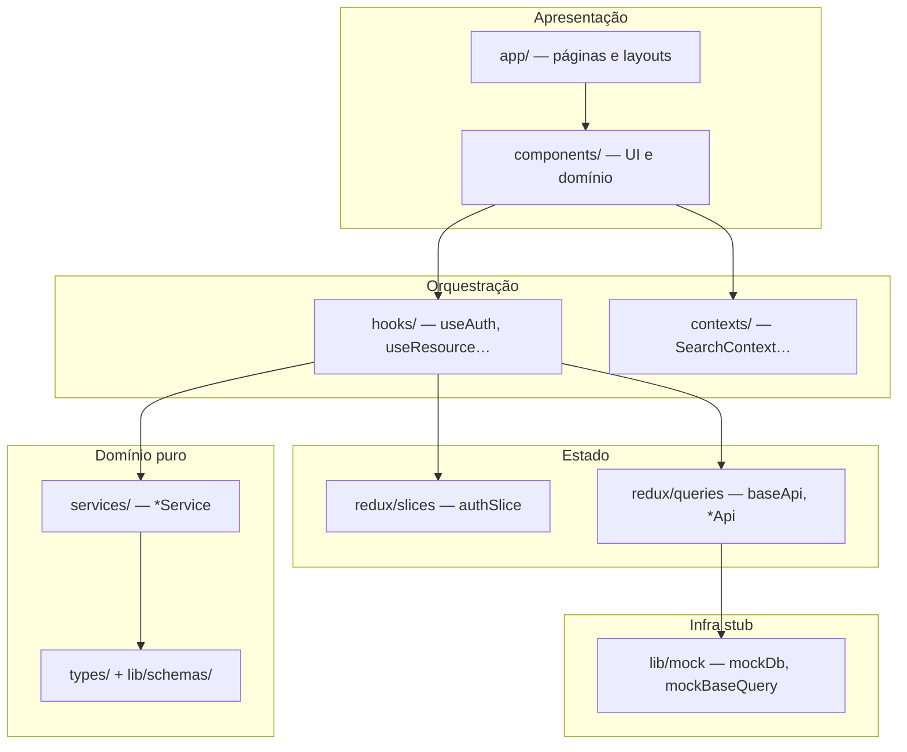
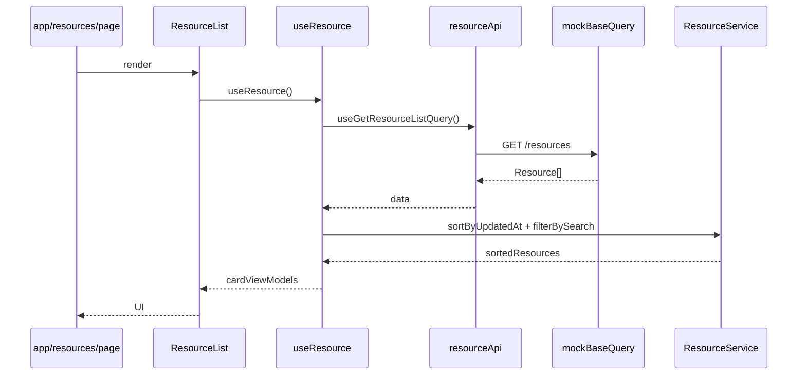

# Arquitetura — BATENTE Frontend

Este documento descreve a arquitetura do boilerplate: responsabilidades por camada, fluxo de dados, stack e regras invioláveis.

## Objetivo

Entregar uma **base replicável** — não um domínio específico. Cada feature futura deve seguir o molde do módulo `resource`, respeitando separação de camadas e SOLID.

## Stack

| Camada | Tecnologia |
|--------|------------|
| Framework | Next.js 16 (App Router) |
| Linguagem | TypeScript (`strict`, `noUncheckedIndexedAccess`) |
| Estilo | Tailwind CSS v4, `clsx`, `tailwind-merge`, `class-variance-authority` |
| UI | Radix UI Primitives encapsulados (padrão Shadcn/UI) |
| Server state | Redux Toolkit + RTK Query |
| UI state global | Redux slices + React Context (estado de UI leve) |
| i18n | `i18next` + `react-i18next` |
| Tema | `next-themes` (escuro fixo — ver "Tema e identidade visual") |
| Forms | React Hook Form + Zod |
| Ícones | `lucide-react` |
| Toasts | `sonner` |
| **Testes** | **Vitest**, Testing Library, MSW 2, Playwright, axe-core |

Backend **stubado** via `lib/mock/` em dev — testes usam `fetchBaseQuery` + MSW (Plano B). Ver [testing.md](./testing.md).

## Estrutura de pastas

```
src/
├── app/                    # Roteamento, layouts e composição de páginas
│   ├── (auth)/             # Área de entrada: login, register, 403
│   ├── (dashboard)/        # Painel protegido: início, monitor, acessos, módulos
│   ├── layout.tsx          # RootLayout + Providers
│   └── globals.css         # Tailwind v4 @theme + tokens BATENTE
├── components/
│   ├── ui/                 # Átomos (Button, Input, Dialog…) — sem domínio
│   ├── auth/               # LoginForm, ProtectedRoute, AuthHydrator
│   ├── <feature>/          # Componentes de domínio (access/, dashboard/, device/)
│   └── shared/             # Sidebar, PageHeader, estados de tela, Providers
├── redux/
│   ├── store.ts
│   ├── hooks.ts            # useAppDispatch, useAppSelector (tipados)
│   ├── storeProvider.tsx
│   └── reducers/
│       ├── slices/         # Estado global de UI (ex.: authSlice)
│       └── queries/        # RTK Query: baseApi + *Api por feature
├── services/               # Lógica pura, classes sem React
├── hooks/                  # Orquestração: queries + slices + services
├── contexts/               # Context API para estado de UI compartilhado
├── types/                  # Interfaces e contratos compartilhados
├── lib/                    # utils, i18n, schemas Zod, mock
└── locales/                # Traduções pt/en por namespace

test/                       # Infraestrutura de testes (ver testing.md)
├── setup/                  # vitest.setup, MSW, matchers
├── mocks/                  # handlers MSW, db, scenarios
├── helpers/                # renderWithProviders, makeTestStore, auth
├── integration/            # testes de página
├── contracts/              # contrato API + LSP baseQuery
├── arch/                   # fronteiras (dependency-cruiser)
├── i18n/                   # paridade de traduções
└── e2e/                    # Playwright (*.spec.ts)
```

Arquivos na raiz relevantes:

- `middleware.ts` — proteção de rotas por cookie
- `components.json` — config Shadcn/UI
- `vitest.config.ts` — projects Vitest (unit, component, hook, …)
- `playwright.config.ts` — E2E (Fase 7)

## Diagrama de camadas



## Regras por camada

### `app/` — Roteamento apenas

**Pode:** definir rotas, layouts, metadata, redirecionamentos server-side, compor componentes.

**Não pode:** regra de negócio, chamadas de API (`fetch`), `useEffect` para server state, lógica de transformação de dados.

```tsx
// ✅ Correto — composição
export default function ResourcesPage() {
  return <ResourceList />;
}

// ❌ Proibido — fetch manual na página
export default function ResourcesPage() {
  useEffect(() => { fetch("/api/resources")… }, []);
}
```

### `components/ui/` — Átomos sem domínio

- Encapsulam Radix + variantes via `cva`
- Composição de classes sempre via `cn()` de `@/lib/utils`
- Sem imports de `redux/`, `services/` ou tipos de domínio
- Acessíveis (teclado, ARIA via Radix)

### `components/<feature>/` — UI de domínio

- Consomem hooks orquestradores (`useResource`, `useAuth`)
- **Nunca** chamam RTK Query hooks diretamente se existir hook orquestrador
- **Nunca** fazem `fetch` manual
- Permissões via `useCanMutate` — não espalhar `if (user.id === ownerId)` nos JSX

### `redux/reducers/queries/` — Única porta de server state

- Um `baseApi` central via [`createBaseApi`](./../src/redux/reducers/queries/createBaseApi.ts)
- **Dev:** `mockBaseQuery` (handlers in-memory, sem HTTP)
- **Vitest:** `fetchBaseQuery` + MSW — mesmo contrato, caminho HTTP real (Plano B)
- Cada feature: `baseApi.injectEndpoints({ … })`
- Cache e invalidação via **tags** (`providesTags` / `invalidatesTags`)
- Endpoints padronizados: `get<Feature>List`, `get<Feature>ById`, `create<Feature>`, `update<Feature>`, `delete<Feature>`

### `redux/reducers/slices/` — Estado de UI global

- Apenas estado que não vem do servidor (ex.: credenciais em memória, preferências de UI)
- Server state **nunca** duplicado em slices — use RTK Query

### `services/` — Lógica pura

- Classes ou funções puras, **sem React**, **sem Redux**
- Transformações, ordenação, mapeamento DTO → ViewModel
- Testáveis unitariamente sem render

### `hooks/` — Orquestração

- Expõem API limpa aos componentes
- Combinam queries/mutations RTK + services + selectors
- Único lugar (além de components) que "sabe" de múltiplas camadas

### `types/` + `lib/schemas/`

- Contratos compartilhados em `types/`
- Schemas Zod em `lib/schemas/` — fonte da verdade para forms
- Tipos de form: `z.infer<typeof schema>`

### `lib/mock/`

- Simula backend in-memory para **desenvolvimento** (`mockBaseQuery`)
- Handlers espelhados em `test/mocks/handlers/` para testes via MSW
- Substituível por API real — contrato LSP provado em `test/contracts/basequery.substitution.test.ts`

## Testes automatizados

Suíte Vitest + MSW + Playwright. Documentação completa em [testing.md](./testing.md).

Resumo:

| Camada | Onde | Ferramenta |
|--------|------|------------|
| Unit | `src/**/*.test.ts` | Vitest |
| Component / Hook | `src/**/*.test.tsx` | Vitest + RTL |
| Integration | `test/integration/` | Vitest + MSW |
| Contract | `test/contracts/` | Vitest + Zod |
| E2E | `test/e2e/*.spec.ts` | Playwright |

**Regra central:** mockar a **rede** (MSW), nunca hooks orquestradores. Referência canônica: módulo `resource`.

## Fluxo de dados (exemplo: listar resources)



## Autenticação (visão resumida)

Dupla camada de proteção:

1. **`middleware.ts`** — lê cookie `auth-token`; bloqueia rotas `(dashboard)` sem token
2. **`ProtectedRoute`** — guard client-side no layout `(dashboard)`
3. **`AuthHydrator`** — restaura sessão Redux a partir do cookie no client

Destino pós-login por papel (`ADMIN`/`RH` → `/inicio`, `OPERADOR` → `/portaria`)
resolvido em `AuthService` — mapa único, sem `if` de papel espalhado.

Detalhes em [auth.md](./auth.md).

## Internacionalização

- Textos **nunca** hardcoded na UI — usar `t()` com namespaces
- Namespaces: `common`, `auth`, `resource`, `nav`, `dashboard`, `device`,
  `access` (+ novos por feature)
- Arquivos: `src/locales/{pt,en}/<namespace>.json`
- Services puros devolvem **chave + valores** (`TranslatableLabel`), nunca
  texto pronto — quem traduz é o componente

## Tema e identidade visual

- Tokens BATENTE em `globals.css` (`@theme inline`)
- **Escuro fixo**: `forcedTheme="dark"` em `Providers`. Entrada e painel só
  têm design escuro; o `ThemeProvider` continua no lugar para quando existir
  um tema claro
- Fontes: IBM Plex Sans, Archivo (variável, eixo `wdth`), IBM Plex Mono

## Convenções de nomenclatura

| Artefato | Padrão | Exemplo |
|----------|--------|---------|
| Componente | PascalCase | `ResourceCard` |
| Hook | `use` + PascalCase | `useResource` |
| Slice | `<feature>Slice` | `authSlice` |
| API RTK | `<feature>Api` | `resourceApi` |
| Service | `<Feature>Service` | `ResourceService` |
| Tipo | PascalCase | `CreateResourcePayload` |
| Endpoint | verbo + Feature | `getResourceList` |

## Paths TypeScript

Alias `@/*` → `src/*`. Sempre preferir imports absolutos:

```typescript
import { useResource } from "@/hooks/useResource";
```

## Checklist antes de abrir PR

- [ ] Nenhum `fetch` / `useEffect` para API em `app/` ou `components/`
- [ ] Server state exclusivamente via RTK Query
- [ ] Textos via i18n
- [ ] Permissões via `useCanMutate` / helper `canMutate`
- [ ] Zero `any`; tipos inferidos de Zod e RTK Query
- [ ] Lógica complexa em `services/`, não em componentes
- [ ] Testes para código novo (seguir molde `resource` — ver [testing.md](./testing.md))
- [ ] `npm run typecheck` e `npm run build` passando
- [ ] `npm run test` passando (unit + component no mínimo)
