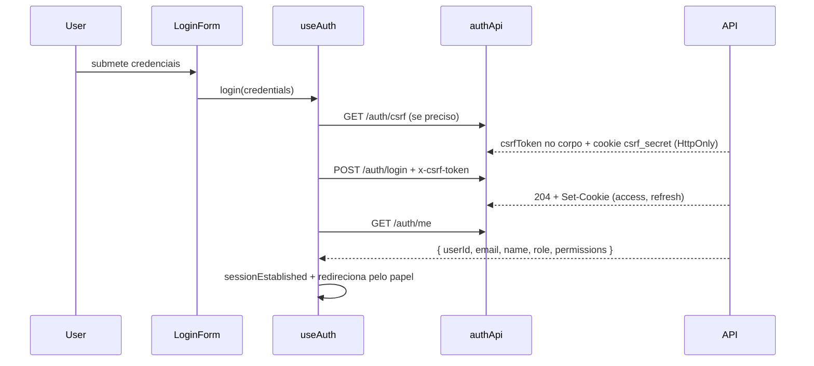

# Autenticação e autorização

A sessão é do **servidor**. O frontend não guarda token, não decodifica token e
não decide autorização — só reage ao que `GET /auth/me` responde.

## Princípio

| Regra | Como é cumprida |
|---|---|
| Nenhum token acessível por JavaScript | `access_token` e `refresh_token` são cookies `HttpOnly`, gravados pelo backend. Não há `localStorage`, `sessionStorage`, nem `token` no Redux |
| O frontend não decide autorização | `ProtectedRoute`, `RoleGuard` e `useCanAccess` são **UX**. Toda rota protegida da API revalida identidade e papel no servidor |
| Sessão descoberta por endpoint | `GET /auth/me` é a única fonte. Nada de ler cookie ou decodificar JWT |

## Fluxo de login



`POST /auth/login` responde **204 sem corpo**: o papel vem de `/auth/me`, nunca
da resposta do login. Em falha, `login` **não lança** — o erro fica no RTK Query
e vira `loginFailure` via `AuthService.parseLoginFailure`.

### A confirmação de sessão tem uma retentativa

`confirmarSessao` em `useAuth` chama `/auth/me` **até duas vezes**, e isso não é
redundância: é exigência do RTK Query.

O `condition` do `queryThunk` rejeita um refetch forçado enquanto existe consulta
pendente para a mesma chave — `status === "pending"` é avaliado **antes** de
`isForcedQuery` — e nesse caso o `unwrap` passa a esperar *aquela* resposta. Se a
consulta em voo for a de boot, emitida antes do login, ela volta `401`. O efeito
era um login bem-sucedido (cookies gravados) seguido de nada: sem navegação e sem
erro, porque o `204` não deixa nada em `loginState.error`.

Uma retentativa basta — `getMe` tem chave única e deduplicada, então depois que a
primeira liquida não resta consulta anterior ao login pendente — e não custa ida
extra no caminho normal.

Quando as duas tentativas falham, `AuthService.sessionConfirmationFailure()`
produz um `LoginFailure` com `code: "unknown"`, para a tela ter o que dizer. O
princípio: **falha muda é pior que falha visível.**

### Quem já tem sessão não fica na tela de entrada

`useRedirectAuthenticated`, consumido pelo `LoginForm`, leva ao destino do papel
quando a sessão já está confirmada. Usa `AuthService.resolveAuthenticatedRoute`,
que **nunca** devolve `/login` — daí não haver laço com o `ProtectedRoute`.

É opt-in por hook, e não dentro de `useAuth`, porque `ProtectedRoute`,
`useCanAccess` e `SidebarUserMenu` também consomem `useAuth`: um efeito de
redirecionamento ali navegaria a partir de toda tela do painel.

Serve também de rede de segurança: se a navegação do `login` não ocorrer, a
hidratação do `SessionProvider` vira `isAuthenticated` e o efeito conclui a
viagem.

A navegação pós-login usa `replace`, não `push` — entrar não deve deixar a tela
de login no histórico.

## Refresh silencioso

Em `401`, o cliente tenta **um** refresh e repete a requisição. Falhando,
devolve o 401 e o `SessionProvider` leva ao login.

A deduplicação em `authBaseQuery.ts` (`refreshEmVoo`) **não é otimização**: o
backend rotaciona o refresh token a cada uso e trata reapresentação como reúso,
revogando a família inteira. Cinco 401 simultâneos sem single-flight
disparariam cinco rotações do mesmo token e derrubariam a sessão.

## CSRF

Cookie de sessão implica CSRF explícito. Com `SameSite=None` (imposto pelo
cross-site), o navegador anexa o cookie a requisições de qualquer site.

O double-submit clássico (ler cookie por JS e repetir no header) **não funciona
aqui**: o JS não lê cookie de outro domínio. Então:

1. `GET /auth/csrf` grava `csrf_secret` (`HttpOnly`) e devolve `csrfToken` no corpo;
2. `lib/csrf.ts` guarda o `csrfToken` **em memória**;
3. todo método mutável envia `x-csrf-token`;
4. o servidor recomputa o HMAC e compara em tempo constante.

O `csrfToken` em memória não contradiz "nenhum token acessível por JS": ele não
autentica ninguém, só prova que a requisição partiu de código capaz de ler a
resposta de `/auth/csrf` — o que a allowlist de CORS nega a terceiros.

## Camadas de proteção

| Camada | Arquivo | Função |
|---|---|---|
| Sessão | `SessionProvider.tsx` | Pergunta `GET /auth/me` e hidrata o slice |
| Rota | `ProtectedRoute.tsx` | Espera `status` resolver; redireciona se anônimo (UX) |
| Papel (tela) | `RoleGuard` | Barra a tela; a URL é digitável, esconder o menu não basta |
| Papel (UI) | `useCanAccess` / `PermissionService` | Itens de menu e blocos |
| Ownership | `useCanMutate` | Ações de escrita |
| **Autoridade** | **backend** | Revalida em toda requisição; papel vem do banco |

**O `middleware.ts` não decide mais autenticação.** Em cross-site o edge do Next
não recebe os cookies da API, e presença de cookie nunca foi prova de sessão.
Custo: um instante de carregamento antes do redirecionamento, em vez de bloqueio
no edge.

## Estado Redux — `authSlice`

```typescript
interface AuthState {
  user: User | null;
  status: "unknown" | "authenticated" | "anonymous";
}
```

Actions: `sessionEstablished`, `sessionCleared`. **Não existe `token`.**

`status` distingue "ainda não perguntei" de "não há sessão" — sem isso o guard
piscaria o login na cara de quem recarrega a página.

`user` espelha `/auth/me`, o que é uma exceção consciente à regra de não
duplicar server state em slice: `authState()` em `test/helpers/auth.ts` pré-carrega
este slice e é usado por outros módulos. A hidratação é unidirecional — só o
`SessionProvider` escreve — então não há duas fontes concorrentes.

## Endpoints

| Endpoint | Método | Observação |
|---|---|---|
| `/auth/csrf` | GET | Emite o token a ecoar em `x-csrf-token` |
| `/auth/login` | POST | 204 sem corpo |
| `/auth/refresh` | POST | Rotação; só o interceptor chama |
| `/auth/logout` | POST | Revoga a família no servidor |
| `/auth/me` | GET | Fonte de verdade da sessão |
| `/users` | POST | **Criação por ADMIN.** Não existe `/auth/register` |

Erros de login seguem `ApiError` com `code` estável e `details`
(`failedAttempts`, `remainingAttempts`, `lockedAt`, `unlockAt`, `occurredAt`).
A UI decide o texto pelo `code` — nunca pela `message`.

## Não existe auto-registro

A rota pública `/register` e o `RegisterForm` foram **removidos**. Criar usuário
é `POST /users`, exclusivo de ADMIN: o servidor responde `403` a qualquer outro
papel, mesmo chamando a API direto, e o caso de uso confere a permissão de novo
por dentro — não só o middleware.

## Transporte

`baseApi` usa uma instância só; `hybridBaseQuery.ts` roteia por prefixo:

- `/auth/*` e `/users` → backend real (`credentials: "include"`, CSRF, refresh);
- resto → mock (`mockBaseQuery` em dev, `fetchBaseQuery` + MSW em teste).

Instância única de propósito: duas fariam `invalidatesTags: ["Auth"]` não
alcançar consultas registradas na outra. E `reducerPath` **precisa** ser o
literal `"api"` — parametrizá-lo alarga o genérico do RTK Query para `string` e
o `RootState` dele vira uma assinatura de índice que rejeita a chave `auth`,
quebrando a tipagem do middleware com uma mensagem que não aponta para a causa.

## Papéis e destino pós-login

| Papel | Rota |
|---|---|
| `ADMIN` | `/inicio` |
| `RH` | `/inicio` |
| `OPERADOR` | `/portaria` |

Mapa único em `AuthService.resolveLandingRoute`, aplicado **depois** de
`/auth/me` confirmar o papel.

`resolveLandingRoute` devolve `/login` quando não há papel — é o destino correto
para "não há sessão". Já `resolveAuthenticatedRoute` parte de uma sessão que
existe e cujo papel pode ser ilegível: ela nunca devolve `/login`, e por isso é a
usada por `useRedirectAuthenticated`. Trocar uma pela outra cria laço de
redirecionamento.

## Revogação

Mudança de papel ou suspensão no banco reflete na requisição seguinte, sem novo
login: o guard do backend relê `users` a cada rota autorizada. O access token
tem 15 min, mas carrega uma época de revogação (`token_version`) conferida na
mesma consulta — reúso de refresh detectado incrementa a época e mata os tokens
vivos na hora.

## Configuração

`NEXT_PUBLIC_API_URL` aponta para a origem da API e precisa constar em
`CORS_ALLOWED_ORIGINS` no backend. Ver `.env.example`.

Em dev, o backend ocupa a `:3000` — rode o front em outra porta:
`npm run dev -- -p 3001`.
