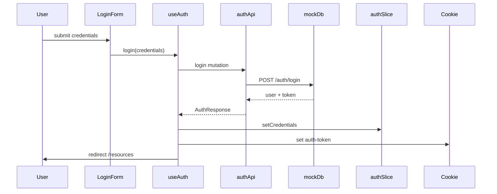

# Autenticação e autorização

## Fluxo de login



## Camadas de proteção

| Camada | Arquivo | Função |
|--------|---------|--------|
| Edge | `middleware.ts` | Redireciona sem cookie `auth-token` |
| Layout | `ProtectedRoute.tsx` | Guard client-side no `(dashboard)` |
| Hidratação | `AuthHydrator.tsx` | Restaura Redux a partir do cookie |
| Autorização | `useCanMutate` | Ownership para ações de escrita |

## Cookie

- Nome: `auth-token` (constante `AUTH_TOKEN_COOKIE` em `types/api.ts`)
- Setado em `useAuth.login` / `register`
- Removido em `logout` e falha de hidratação

## Estado Redux — `authSlice`

```typescript
interface AuthState {
  user: User | null;
  token: string | null;
}
```

Actions: `setCredentials`, `setToken`, `logout`.

## Endpoints stub — `authApi`

| Endpoint | Método | Descrição |
|----------|--------|-----------|
| `/auth/login` | POST | Autentica usuário |
| `/auth/register` | POST | Cria usuário |
| `/auth/me` | GET | Retorna usuário atual |
| `/auth/logout` | POST | Revoga sessão mock |

## Credenciais demo

| Email | Senha | Recursos owned |
|-------|-------|----------------|
| `owner@batente.dev` | `password123` | resource-1, resource-2 |
| `viewer@batente.dev` | `password123` | resource-3 |

## Autorização por ownership

Regra: **editar/excluir** só quando `resource.ownerId === user.id`.

Centralizado em:

- `canMutate(resource, user)` — função pura testável
- `useCanMutate(resource)` — hook para componentes

**Proibido** espalhar checks de permissão inline nos JSX.

## Migrar para backend real

1. Substituir `mockBaseQuery` por `fetchBaseQuery` em `baseApi.ts`
2. Implementar `prepareHeaders` para JWT
3. Tratar `401` com re-auth (limpar slice + cookie + redirect `/login`)
4. Manter mesma interface de `authApi` e `useAuth` — componentes intactos
