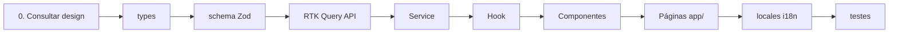

# Guia de módulos de feature

Passo a passo para adicionar um domínio replicando o molde `department` — o
mais simples com CRUD completo, diálogo de formulário e tratamento de erro do
banco. Para tela com formulário de página inteira, ver `employee`; para grade
editável, `schedule`.

## Visão geral

Ordem recomendada de implementação:



## 0. Consultar design — `docs/screens.md` + `docs/Telas Batente.zip`

Antes de criar types ou código, verificar se a tela alvo já existe no design:

1. Consultar [screens.md](./screens.md) → localizar bloco e IDs de tela
2. Abrir o HTML correspondente em [`Telas Batente.zip`](./Telas%20Batente.zip)
3. Verificar implementação existente em `src/app/` e `src/components/`
4. Se já implementada → evoluir alinhado ao design; se placeholder → substituir `ModulePlaceholder`

Ver também [agents.md](./agents.md) para o fluxo completo do agente.

## 1. Tipos — `src/types/<feature>.ts`

```typescript
export interface Order {
  id: string;
  title: string;
  ownerId: string;
  createdAt: string;
  updatedAt: string;
}

export interface CreateOrderPayload {
  title: string;
}

export interface UpdateOrderPayload {
  id: string;
  title?: string;
}
```

## 2. Schema Zod — `src/lib/schemas/<feature>Schema.ts`

```typescript
import { z } from "zod";

export const orderFormSchema = z.object({
  title: z.string().min(3).max(100),
});

export type OrderFormValues = z.infer<typeof orderFormSchema>;
```

## 3. RTK Query — `src/redux/reducers/queries/<feature>Api.ts`

```typescript
import { baseApi } from "@/redux/reducers/queries/baseApi";

export const orderApi = baseApi.injectEndpoints({
  endpoints: (builder) => ({
    getOrderList: builder.query<Order[], void>({ … }),
    getOrderById: builder.query<Order, string>({ … }),
    createOrder: builder.mutation<Order, CreateOrderPayload>({ … }),
    updateOrder: builder.mutation<Order, UpdateOrderPayload>({ … }),
    deleteOrder: builder.mutation<{ id: string }, string>({ … }),
  }),
});

export const {
  useGetOrderListQuery,
  useGetOrderByIdQuery,
  useCreateOrderMutation,
  useUpdateOrderMutation,
  useDeleteOrderMutation,
} = orderApi;
```

Registrar side-effect import em `src/redux/store.ts`:

```typescript
import "@/redux/reducers/queries/orderApi";
```

Adicionar tag em `baseApi.ts`:

```typescript
tagTypes: ["Auth", "Department", "Order"],
```

Estender `mockBaseQuery` com rotas `/orders` (dev) **e** handler MSW em `test/mocks/handlers/` (testes). Ver [testing.md](./testing.md).

## 4. Service — `src/services/OrderService.ts`

```typescript
export class OrderService {
  static sortByUpdatedAt(orders: Order[]): Order[] { … }
  static toCardViewModel(order: Order): OrderCardViewModel { … }
}
```

Sem imports de React ou Redux.

## 5. Hook — `src/hooks/useOrder.ts`

Orquestra queries, mutations e `OrderService`. Expõe API estável aos componentes.

## 6. Componentes — `src/components/<feature>/`

Mínimo para CRUD:

| Componente | Responsabilidade |
|------------|------------------|
| `<Feature>List` | Listagem + busca |
| `<Feature>Card` | Card com ações condicionais (`useCanMutate`) |
| `<Feature>Form` | Create/update com RHF + Zod |
| `<Feature>DeleteDialog` | Confirmação + mutation delete |

## 7. Páginas — `src/app/(dashboard)/<feature>/`

```
<feature>/
├── page.tsx           # listagem
├── new/page.tsx       # create
└── [id]/
    ├── page.tsx       # detail
    └── edit/page.tsx  # update
```

Páginas apenas compõem componentes — sem lógica.

## 8. i18n — `src/locales/{pt,en}/<feature>.json`

Registrar namespace em `src/lib/i18n/settings.ts`:

```typescript
export const namespaces = ["common", "auth", "department", "order"] as const;
```

## 9. Navegação

Adicionar item em `src/components/shared/Sidebar.tsx`.

## 10. Proteção de rotas

Estender `middleware.ts`:

```typescript
const protectedPaths = ["/departamentos", "/orders"];
```

## 11. Testes — molde `department`

Para cada feature nova, replicar a cobertura do módulo `department`. Documentação completa: [testing.md](./testing.md).

| Camada | Arquivo | Obrigatório |
|--------|---------|-------------|
| Unit | `src/services/<Feature>Service.test.ts` | ✅ |
| Unit | `src/lib/schemas/<feature>Schema.test.ts` | ✅ |
| MSW | `test/mocks/handlers/<feature>.handlers.ts` | ✅ |
| Hook | `src/hooks/use<Feature>.test.tsx` | ✅ |
| Component | `src/components/<feature>/*.test.tsx` | ✅ por componente principal |
| Integration | `test/integration/<feature>-list.test.tsx` | ✅ listagem |
| Contract | validação Zod no handler MSW | ✅ |

```typescript
// Exemplo — unit ao lado do service
describe('OrderService', () => {
  it('RN-X · ordena por updatedAt', () => { … });
});

// Exemplo — component com renderWithProviders
import { renderWithProviders } from '../../../test/helpers/render';
import { authState } from '../../../test/helpers/auth';

renderWithProviders(<OrderList />, {
  preloadedState: authState('ADMIN'),
});
```

**Regras:** mockar rede (MSW), nunca `useOrder`. Store novo por teste. Referência: arquivos `*department*` em `src/` e `test/`.

## Ownership (autorização)

Reutilizar padrão de `useCanMutate` — criar helper genérico se necessário:

```typescript
export function canMutate<T extends { ownerId: string }>(
  entity: T | undefined,
  user: User | null,
) {
  return {
    canEdit: Boolean(user && entity && entity.ownerId === user.id),
    canDelete: Boolean(user && entity && entity.ownerId === user.id),
  };
}
```

## Referência completa

Use o módulo `department` como implementação canônica:

- `src/types/department.ts`
- `src/lib/schemas/departmentSchema.ts`
- `src/redux/reducers/queries/departmentApi.ts`
- `src/services/DepartmentService.ts`
- `src/hooks/useDepartment.ts`
- `src/components/department/*`
- `src/app/(dashboard)/departamentos/*`
- `src/services/DepartmentService.test.ts` — unit
- `src/components/department/DepartmentList.test.tsx` — component
- `src/hooks/useDepartment.test.tsx` — hook
- `test/integration/monitor-access.test.tsx` — integration
- `test/contracts/api.contract.test.ts` — contract
