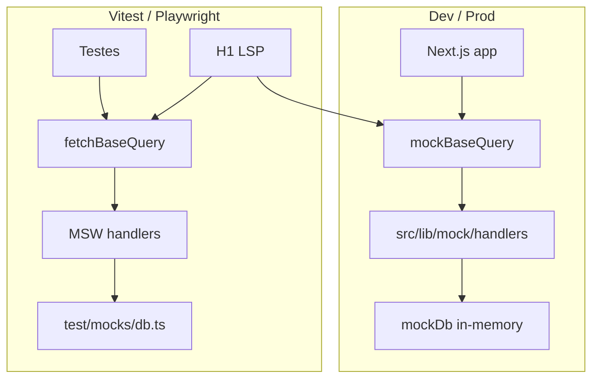

# Arquitetura de testes — BATENTE Frontend

Documentação canônica da suíte automatizada do painel administrativo. Complementa [architecture.md](./architecture.md) e materializa o princípio **L** (Liskov) descrito em [solid-principles.md](./solid-principles.md).

## Objetivo

Garantir que o painel:

1. **Não mostre dado que o papel não pode ver** — defesa em profundidade na renderização (RN-1.6, RN-9.8).
2. **Não esconda pendências** que o RH precisa resolver.
3. **Não vaze existência de conta** na tela de login (RN-1.5).
4. **Não passe verde contra mock mentiroso** — testes exercitam HTTP real via MSW.
5. **Não exclua usuários por acessibilidade** — portaria e painel operam com teclado e pressa.

## Decisões de arquitetura

| ID | Decisão | Status |
|---|---|---|
| **D-01** | **Vitest** — projects internos, `expectTypeOf`, watch mode | ✅ Implementado |
| **D-02** | **Plano B** — `mockBaseQuery` em dev; testes usam `fetchBaseQuery` + MSW; suíte LSP (H1) prova paridade | ✅ Implementado (Fase 0) |

### Plano B — dual baseQuery



- **Dev/prod:** [`baseApi.ts`](../src/redux/reducers/queries/baseApi.ts) usa `mockBaseQuery` — sem HTTP, handlers in-memory.
- **Vitest:** `process.env.VITEST === "true"` troca para `createFetchBaseQuery()` — MSW intercepta na camada de rede.
- **Factory:** [`createBaseApi.ts`](../src/redux/reducers/queries/createBaseApi.ts) permite injetar qualquer `BaseQueryFn` (contrato LSP).
- **Contrato H1:** [`test/contracts/basequery.substitution.test.ts`](../test/contracts/basequery.substitution.test.ts) — mesma bateria contra mock e fetch.

## Stack de testes

| Camada | Ferramenta |
|---|---|
| Unit / component / hook / integration / contract | **Vitest** 4 + jsdom |
| Component / hook rendering | **Testing Library** + user-event |
| Rede simulada | **MSW** 2 (`setupServer`) |
| Acessibilidade (componente) | **axe-core** + vitest-axe |
| E2E (Fase 7) | **Playwright** |
| Fronteiras de módulo (Fase 1) | **dependency-cruiser** |
| Bundle budget (Fase 7) | **size-limit** |

## Taxonomia — oito camadas

| # | Camada | Escopo | Project Vitest | Onde vive |
|---|---|---|---|---|
| 1 | **Unit** | `services/`, `lib/schemas/`, utils, middleware | `unit` | `src/**/*.test.ts` |
| 2 | **Type** | `expectTypeOf`, Zod ↔ types | inline nos `.test.ts` | junto ao código |
| 3 | **Component** | `components/ui/`, `components/<feature>/` | `component` | `src/**/*.test.tsx` |
| 4 | **Hook** | `hooks/` + store real + MSW | `hook` | `src/hooks/**/*.test.tsx` |
| 5 | **Integration** | Página completa, MSW, sem mock de hook | `integration` | `test/integration/` |
| 6 | **Contract** | MSW × Zod; LSP baseQuery | `contract` | `test/contracts/` |
| 7 | **E2E** | Navegador real, middleware, cookies | Playwright | `test/e2e/*.spec.ts` |
| 8 | **Quality gates** | arch, i18n, a11y, size, Lighthouse | `arch`, `i18n`, etc. | `test/arch/`, `test/i18n/` |

## Estrutura de diretórios

```
src/
├── services/DepartmentService.test.ts       # unit — colado ao código
├── lib/schemas/departmentSchema.test.ts
├── components/ui/Button.test.tsx
├── components/department/DepartmentList.test.tsx
├── hooks/useDepartment.test.tsx
└── redux/reducers/queries/
    ├── createBaseApi.ts                   # factory Liskov
    ├── fetchBaseQuery.ts                  # HTTP + JWT (testes)
    └── baseApi.ts                           # mock em dev, fetch em Vitest

test/
├── README.md                              # guia rápido (este doc é a referência)
├── setup/
│   ├── vitest.setup.ts                    # jest-dom, MSW, TZ, polyfills
│   ├── msw.server.ts
│   └── matchers/                          # a11y, labor data, LGPD
├── mocks/
│   ├── handlers/                          # auth, domínio, stubs
│   ├── db.ts                              # estado in-memory (reset por teste)
│   └── scenarios.ts                       # contaBloqueada, servidorIndisponivel…
├── helpers/
│   ├── render.tsx                         # renderWithProviders
│   ├── store.ts                           # makeTestStore
│   ├── auth.ts                            # authState('RH'), loginAs
│   ├── clock.ts                           # vi.setSystemTime, TZ Recife
│   └── a11y.ts
├── integration/
├── contracts/
├── arch/                                  # Fase 1
├── i18n/                                  # Fase 1
└── e2e/                                   # Fase 7
```

**Regra de colocation:** unit/component/hook ficam ao lado do código (`*.test.ts(x)`). Infraestrutura compartilhada mora em `test/`. E2E usa extensão `.spec.ts` para não colidir com Vitest.

## Scripts npm

```bash
npm run test              # unit + component (gate rápido de PR)
npm run test:watch        # watch mode — todos os projects
npm run test:unit         # services, schemas, utils
npm run test:component    # components/ui e components/<feature>
npm run test:hook         # hooks com store real + MSW
npm run test:int          # integração de página
npm run test:contract     # contrato MSW ↔ Zod + LSP
npm run test:arch         # fronteiras (Fase 1)
npm run test:i18n         # paridade pt/en (Fase 1)
npm run test:types        # tsc + expectTypeOf
npm run test:a11y         # grep a11y em component
npm run test:e2e          # Playwright (Fase 7)
npm run test:cov          # cobertura v8
npm run test:all          # suíte completa (CI)
```

## Configuração

### Vitest ([`vitest.config.ts`](../vitest.config.ts))

- `environment: jsdom`, `globals: true`
- `setupFiles: ['./test/setup/vitest.setup.ts']`
- `vite-tsconfig-paths` para `@/*`
- `css: false` (performance)
- `pool: threads`, `restoreMocks`, `clearMocks`
- Projects: `unit`, `component`, `hook`, `integration`, `contract`, `arch`, `i18n`
- Timeouts: 5 s (unit/component/hook), 15 s (integration/contract)
- `TZ=America/Recife` fixo no setup

### Setup obrigatório ([`test/setup/vitest.setup.ts`](../test/setup/vitest.setup.ts))

- `@testing-library/jest-dom`
- MSW `server.listen({ onUnhandledRequest: 'error' })` — requisição não mapeada **quebra** o teste
- Polyfills: `matchMedia`, `IntersectionObserver`, `ResizeObserver`, `scrollIntoView`
- Mock de `next/navigation` e `next/link`
- `cleanup()` automático após cada teste
- `resetTestDb()` após cada teste
- **`resetAuthClientState()` e `setMockSession(null)` após cada teste** — estado de
  módulo não morre com o componente: `csrfToken` e `refreshEmVoo` vivem em
  `lib/csrf.ts` / `authBaseQuery.ts`, e a sessão do mock vive em
  `auth.handlers.ts`. Sem esse reset, um teste que faz login deixa o próximo já
  autenticado

**Armadilha do router.** O mock de `next/navigation` devolve um objeto **novo a
cada chamada** de `useRouter()`, então o spy que ele cria não é o que o
componente usou. Para asserir `push`/`replace`, sobrescreva o mock no próprio
spec com um router estável içado por `vi.hoisted` — ver
`src/hooks/useAuth.test.tsx`.

### Playwright ([`playwright.config.ts`](../playwright.config.ts))

- `webServer`: `next build && next start` (nunca `next dev`), porta **3000** —
  imposta pelo `CORS_ALLOWED_ORIGINS` do backend
- Projects mockados: `chromium`, `webkit`, `mobile-chrome` (ignoram `@real`)
- Project **`e2e-real`**: só os testes com tag `@real`, contra o backend de
  verdade; serial, para não bater no limite de taxa de `/auth/login`
- `retries: 2` no CI, `0` local

```bash
npm run test:e2e         # tudo
npm run test:e2e:real    # só o fluxo contra a API real
```

O `e2e-real` exige Postgres no Docker e a API na `:3030`; o spec faz um ping em
`/auth/csrf` e **pula com aviso** se a API não responder, em vez de pintar a
suíte de vermelho por infraestrutura ausente.

Esta camada não é redundante com a de integração: o Vitest roda em jsdom sobre
módulos já transformados, então passa mesmo quando o bundle **não hidrata** no
navegador — modo de falha real, em que o formulário faz submit nativo e joga a
senha na query string. `test/e2e/login.spec.ts` afirma justamente isso.

## Infraestrutura de teste

### `renderWithProviders`

Helper único que envolve o componente em todos os providers reais.

Aceita `withSession` (padrão **desligado**), que monta o `SessionProvider` — quem
dispara o `GET /auth/me` de boot. Deixe desligado quando o teste pré-carrega a
sessão com `authState()`: montar o provider custaria uma ida à rede sem ganho.
Ligue quando o objeto sob teste **é** a descoberta de sessão — inclusive a corrida
entre a consulta de boot e o login, que só existe quando essa consulta existe (ver
`test/integration/login.test.tsx`).

```typescript
import { renderWithProviders } from '../../test/helpers/render';
import { authState } from '../../test/helpers/auth';

const { user, store } = renderWithProviders(<DepartmentList />, {
  preloadedState: authState('RH'),
  locale: 'pt',
  theme: 'dark',
});
```

Providers: Redux (`makeTestStore`), i18n (instância de teste), ThemeProvider, SearchProvider.

**Store novo a cada teste** — store compartilhado é fonte principal de flaky.

### `makeTestStore`

Em Vitest, `baseApi` já usa `fetchBaseQuery` + MSW. Não é necessário injetar baseQuery manualmente:

```typescript
import { makeTestStore } from '../../test/helpers/store';

const store = makeTestStore(authState('ADMIN'));
```

### MSW — handlers como fonte única

Handlers em [`test/mocks/handlers/`](../test/mocks/handlers/) espelham contratos de [`src/lib/mock/handlers/`](../src/lib/mock/handlers/).

- Auth via header `Authorization: Bearer <token>` (não Redux state)
- `test/mocks/db.ts` — reset em `afterEach`
- `test/mocks/scenarios.ts` — composição de estados de alto nível

```typescript
import { scenarios } from '../mocks/scenarios';

scenarios.contaBloqueada({ email: 'x@y.com', unlockAt: '2026-08-01T12:00:00Z' });
scenarios.servidorIndisponivel();
scenarios.reset(); // automático no afterEach
```

### Matchers customizados

| Matcher | Uso |
|---|---|
| `toHaveNoA11yViolations` | axe em container |
| `toContainNoLaborData` | RN-1.6 / RN-9.8 — OPERADOR |
| `toContainNoPersonalData` | LGPD — CPF, atestado |

## Princípios inegociáveis

1. **Testar pelo que o usuário percebe** — `getByRole`, `getByLabelText`. `data-testid` só quando não há alternativa semântica.
2. **Nunca mockar hook orquestrador** em teste de integração — mockar a **rede** (MSW), não `useDepartment`.
3. **Zero espera arbitrária** — `findBy*`, `waitFor` com condição. Proibido `setTimeout` fixo.
4. **Determinismo** — relógio congelado (`vi.setSystemTime`), `TZ=America/Recife`, locale fixo.
5. **Acessibilidade obrigatória** — axe em `components/ui/` e páginas.
6. **i18n é contrato** — não assertar string traduzida literal; usar role/label ou testes dedicados de i18n.
7. **Rastreabilidade** — referenciar RN-* no `it`: `RN-1.5 · exibe mesma mensagem…`
8. **Falha fechada** — todo teste de permissão tem o negativo correspondente.
9. **Server state não se duplica** — teste que detecta entidade de query copiada para slice deve falhar.
10. **Sem assertar internals** — proibido `dispatch` chamado, action disparada, estado interno RTK.

## Proibições

- ❌ Mockar `useDepartment`, `useAuth` ou hook orquestrador em teste de página
- ❌ Mockar `fetch` global — interceptação é do MSW
- ❌ Assertar string traduzida literal em teste de componente de feature
- ❌ Snapshot de DOM inteiro
- ❌ Assertar `dispatch` ou estado interno RTK Query
- ❌ `waitFor` com timeout inflado para mascarar corrida
- ❌ Rodar E2E contra `next dev`
- ❌ Alterar código de produção para acomodar teste sem documentar

## Referência viva — módulo `department`

Implementação canônica de cada camada (Fase 0 ✅):

| Camada | Arquivo | Casos |
|---|---|---|
| Unit | `DepartmentService.test.ts` | sortByUpdatedAt, toCardViewModel, filterBySearch |
| Unit | `departmentSchema.test.ts` | Zod min/max, expectTypeOf |
| Component | `Button.test.tsx` | variantes, disabled, axe |
| Component | `DepartmentList.test.tsx` | permissão por papel, axe |
| Hook | `useDepartment.test.tsx` | listagem MSW, store real |
| Integration | `test/integration/department-list.test.tsx` | loading → dados → vazio → erro |
| Contract | `api.contract.test.ts` | handler × schema Zod |
| Contract | `basequery.substitution.test.ts` | H1 LSP mock ↔ fetch |

## Suíte de autenticação (Fase 3)

| Camada | Arquivo | Foco |
|---|---|---|
| Unit | `src/services/AuthService.test.ts` | classificação de falha, destinos por papel, contagem de bloqueio |
| Unit | `src/lib/schemas/authSchema.test.ts` | validação da entrada; login **sem** mínimo de senha |
| Hook | `src/hooks/useAuth.test.tsx` | corrida do `/auth/me` de boot, `replace`, falha de confirmação, logout |
| Component | `src/components/auth/LoginForm.test.tsx` | estados visuais, alertas, bloqueio com contagem, a11y |
| Integration | `test/integration/login.test.tsx` | página com `SessionProvider`, do anônimo à navegação |
| Contract | `test/contracts/auth.contract.test.ts` | `/auth/me` × Zod, `code` estável, CSRF obrigatório |
| E2E | `test/e2e/login.spec.ts` | backend real: hidratação, cookies HttpOnly, sessão pós-reload |

## Escrever teste para nova feature

Seguir o molde `department` — ver [feature-module-guide.md](./feature-module-guide.md) passo 11.

Ordem recomendada:

1. Unit em `*Service.test.ts` e `*Schema.test.ts`
2. MSW handler em `test/mocks/handlers/<feature>.handlers.ts` + registrar em `index.ts`
3. Hook test com store real
4. Component tests com `renderWithProviders`
5. Integration test da listagem/página principal
6. Contract test validando response com Zod

## Cobertura (metas de CI)

| Caminho | Statements | Branches |
|---|---|---|
| Global | 80% | 75% |
| `src/services/**` | 95% | 92% |
| `src/lib/schemas/**` | 95% | 90% |
| `src/middleware.ts` | 100% | 100% |
| `src/hooks/**` | 90% | 85% |
| `src/components/ui/**` | 85% | 80% |

Excluídos: `app/**/layout.tsx`, `**/index.ts`, `locales/**`, `lib/mock/**`.

## Roadmap de fases

| Fase | Escopo | Status |
|---|---|---|
| **0 · Fundação** | Runner, MSW, helpers, matchers, suíte `department` | ✅ |
| **1 · Fronteiras** | `test:arch`, `test:i18n`, `test:types` | 🔜 |
| **2 · Design system** | `components/ui/` completo — variantes, teclado, axe | 🔜 |
| **3 · Auth** | Login: unit, hook, component, integration, contract, E2E real | ✅ |
| **4 · Contrato** | H1–H8 — prepareHeaders, validação Zod completa | 🔜 |
| **5 · Molde feature** | I1–I9 + G1–G9 para `department` | 🔜 |
| **6 · Domínio** | J1–J19 como `test.todo`; E2E N1–N3 | 🔜 |
| **7 · Qualidade contínua** | Playwright, visual, size-limit, LHCI, CI | 🔜 |

## CI/CD (referência Fase 7)

```yaml
static      → eslint + tsc + test:arch + test:i18n     (~1 min)
unit        → test:unit + test:component + coverage    (~2 min)
contract    → test:contract
integration → test:int
e2e         → next build && start + playwright (2 shards) (~4 min)
budget      → size-limit
nightly     → Lighthouse CI + visual + npm audit
```

## Convenções

- **AAA** com separação visual
- `describe` = artefato; `describe` aninhado = contexto (`quando o papel é OPERADOR`)
- `it` em **português**, iniciado pelo ID da regra quando houver
- Consultas: `getByRole` > `getByLabelText` > `getByText` > `getByTestId`
- `userEvent` sempre — nunca `fireEvent` (exceto sem equivalente)
- `findBy*` para assíncrono; `queryBy*` só para asserção de ausência

```typescript
describe('LoginForm', () => {
  describe('quando a credencial é inválida', () => {
    it('RN-1.5 · exibe a mesma mensagem que para e-mail inexistente', async () => {
      // arrange / act / assert
    });
  });
});
```

## Depurar

```bash
npm run test:watch                    # re-run ao salvar
npm run test:unit -- DepartmentService  # filtrar por nome
npm run test:e2e:ui                   # Playwright interativo
npx playwright show-trace trace.zip   # trace on-first-retry
```

## Links

- Guia rápido: [`test/README.md`](../test/README.md)
- Arquitetura geral: [architecture.md](./architecture.md)
- Molde de feature + testes: [feature-module-guide.md](./feature-module-guide.md)
- Auth testável: [auth.md](./auth.md)
